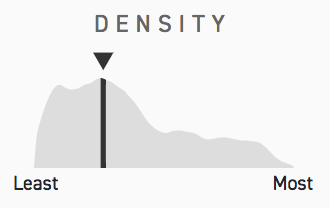

# module-density-rank-chart

Draws a kernel density estimate of a distribution while highlighting a particular point within the distribution. Well-suited for small multiples showing how a member of a population compares to its peers.

[Demo.](https://the-politico.github.io/module_density-rank-chart/)

A [reusable chart module](https://github.com/The-Politico/generator-politico-graphics) made with ❤️ at POLITICO.



### Install
```bash
$ yarn add git+ssh://git@github.com:The-Politico/module_density-rank-chart
```

### Use

##### As a module

To use as a module, simply import the chart object:
```javascript
import DensityRankChart from 'module-density-rank-chart';
```


The chart object has three methods, one to create the chart, initially, another to update chart elements with new data, and one to resize the chart.

To start, pass the chart a point to highlight in a distribution and an array of the data points that represent the distribution.

```javascript
import kernel from 'kernel-smooth';

const myChart = new DensityRankChart();

// The create method needs a selection string, which will be parent
// to the chart elements, and a data array. You can also provide an
// optional properties object. Defaults shown.
const props = {
  densityFill: '#ddd',
  pointFill: '#333',
  height: 60,
  margin: {
    top: 15,
    right: 10,
    bottom: 0,
    left: 10,
  },
  axisLabels: {
    min: 'Least',
    max: 'Most',
  },
  title: 'Density',
  kernel: {
    function: kernel.fun.epanechnikov,
    bandwidth: 0.05,
  },
};

const point = 0.05;
const data = [
  0.01, 0.2, 0.3, 0.82, // ...
]

myChart.create('#chart', point, data, props);

// The update method takes new data to update chart elements.
myChart.update(newPoint, newData, newProps);

// The resize method can be called at any point to update the chart's size.
myChart.resize();
```

To apply this chart's default styles when using SCSS, simply define the variable `$DensityRankChart-container` to represent the ID or class of the chart's container(s) and import the `_chart.scss` partial.

```CSS
$DensityRankChart-container: '#chart';

@import '~module-density-rank-chart/src/scss/chart';
```


##### In the browser

Include any dependencies, your stylesheet and the minified bundle, which defines a global chart object, `DensityRankChart`.

```html
<!-- head -->
<script src="https://d3js.org/d3.v5.min.js"></script>
<script src="chart.min.js"></script>
<link rel="stylesheet" type="text/css" href="styles.css" />

<!-- body -->
<div id="DensityRankChart-container"></div>

<script type="text/javascript">
var myChart = new DensityRankChart();

myChart.create('#DensityRankChart-container', data);
</script>
```


### Developing the chart

Start developing:
```bash
$ yarn start
```

Build for production:
```bash
$ yarn build
```

Read [DEVELOPING](DEVELOPING.md) for more information on using this chart module pattern.
